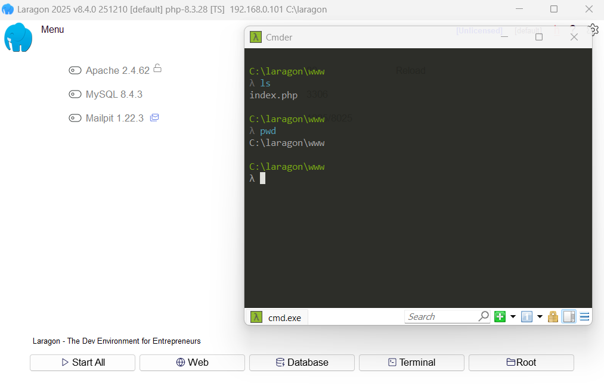

# Install PHP Windows
References:
- Brad Traversy: https://www.udemy.com/course/php-from-scratch-course/learn/lecture/41057064#overview

## Laragon
`Laragon` is a more *modern* solution than XAMPP and WAMP. It includes Apache, MySQL, PHP, Cmder (a third-party bash terminal) and more in a lightweight package:
- Apache 2.4, Nginx, MySQL 9.4/8.4, PHP 8.4/8.3/8.2/8.1, Node.js 24/23/22, Python 3.13, Redis, Memcached, PostgreSQL 18/17/16/15, npm, git, Composer...

Install via `Laragon` on Windows:
1. Download and install Laragon from https://laragon.org/download/
2. During installation, select PHP as one of the components.
3. After installation, start Laragon and use the built-in terminal to run PHP commands.

    
    

4. You can add tools by right-clicking the dialog:

    


### Creating Virtual Hosts with Laragon
- Apache root is c:\laragon\www
- Create a sub-folder `test-app`
- Restart Apache (will get a message "App making changes - Virtual host") 
- Can now will access on:
    - http://localhost/test-app
    - http://test-app.test


---

### Install just PHP on Windows:
1. Download the latest PHP version from the official website: https://windows.php.net/download/
2. Extract the downloaded ZIP file to a directory of your choice (e.g., `C:\php`).
3. Add the PHP directory to your system's PATH environment variable.
4. Verify the installation by opening Command Prompt and running:
   ```cmd
   php -v
   ```
---


## Composer - PHP Dependency Manager
**NOTE**: Laragon already has Composer incorporated - run it from the Laragon integrated Command line: Cmder


(Taken from Unlock PHP 8: see in this repo: unlock-php8/Composer.md )

[]: # Path: ComposerWindows.md
### Install composer with windows
- Download the installer from the [official website](https://getcomposer.org/download/)
- Run the installer
- Check the installation
```bash
composer
```

---

## VS Code Extensions for PHP
- **PHP Intelephense**: Provides advanced PHP language features like code completion, linting, and more.
- **PHP Debug**: Adds support for debugging PHP code using Xdebug.
- **PHP DocBlocker**: Helps in generating PHPDoc comments for your functions and classes.
   - Usage: Type `/**` above a function or class and press Enter to auto-generate a DocBlock.
- **PHP Namespace Resolver**: Assists in managing and importing PHP namespaces.

---


## Debugging

### Install Xdebug
References: 
- https://xdebug.org/docs/install 
- Mostly ok: https://pen-y-fan.github.io/2021/08/03/How-to-Set-up-VS-Code-to-use-PHP-with-Xdebug-3-on-Windows/

MY specific steps:
- Go to https://xdebug.org/download, download the correct php version (e.g. 8.4, nts)
- Confirm/allow the download in the Browser if it doesn't complete automatically
- Copy the dll (php_xdebug-3.5.0-8.4...) to c:\laragon\php\php-8.4.... (Tip: Use Laragon to open this folder using: Menu > PHP > dir:ext)
- Next add Xdebug configuration to php.ini:
   - Laragon Menu > PHP > php.ini
   - Wait for php.ini to open with Notepad++, scroll to the bottom of the file and add the exact name of the .dll:
   ```ini
      [xdebug]
      zend_extension="php_xdebug-3.5.0-8.4-nts-vs17-x86_64.dll"
      xdebug.mode=coverage,debug,develop
      xdebug.start_with_request=yes
      xdebug.client_port=9003
   ```

- Back in Laragon verify xdebug is activated with:
   - The Xdebug extension: Menu > PHP > Quick settings > ☑ xdebug (note it wouldn't let me check/uncheck this )
   - the Cmder terminal:
      ```bash
      λ php -v
      PHP 8.4.12 (cli) (built: Aug 26 2025 18:01:53) (NTS Visual C++ 2022 x64)
      Copyright (c) The PHP Group
      Zend Engine v4.4.12, Copyright (c) Zend Technologies
         with Xdebug v3.5.0, Copyright (c) 2002-2025, by Derick Rethans
      ```
- In VS Code, go to Settings: set the `php.debug.executablePath` value to the location of the php.exe file
    "php.debug.executablePath": "C:\\laragon\\bin\\php\\php-8.4.12-nts-Win32-vs17-x64\\php.exe"

---

### Generic Debugging Steps
1. Right click on the directory of your PHP file -> "Copy Relative Path"
2. In VS Code terminal, CD to that directory
3. Open the PHP file you want to debug.
4. Set breakpoints by clicking left of line numbers.

#### Debugging a script file
1. In top right of VS Code, Select the Debug Icon (play button with bug) -> "**Debug PHP File**"
   The debugger will pause at breakpoints, allowing you to inspect variables, step through code

#### Server-side Debugging
1. Click the VS Code Debug Icon (play button with bug)
2. Select "**Listen for Xdebug**"
3. Set breakpoints by clicking left of line numbers
4. In the terminal, start your PHP server (`php -S localhost:8000`)
5. Open your browser and navigate to (or refresh if already open) `localhost:8000/yourpage.php`: 
   The debugger will pause at breakpoints, allowing you to inspect variables, step through code

---


